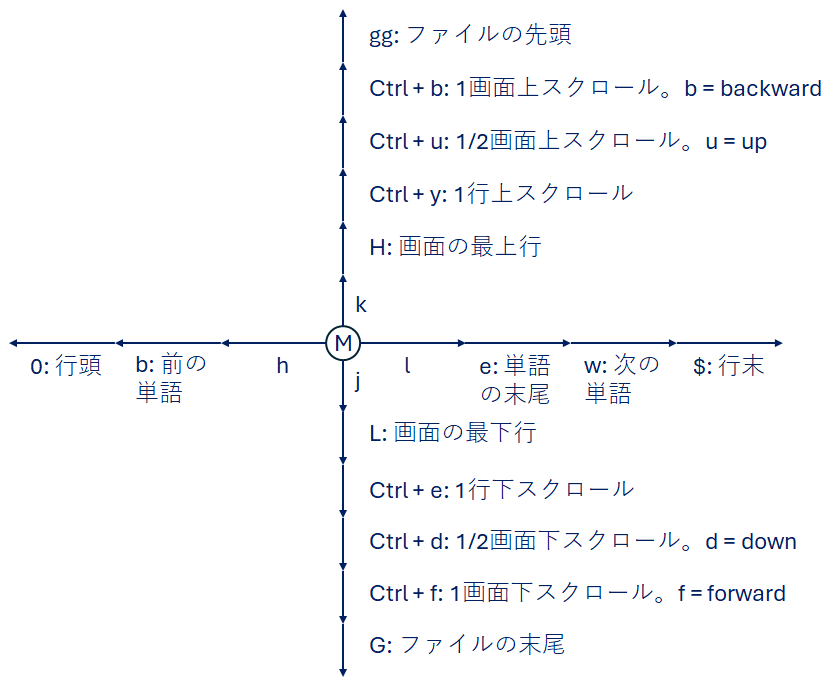
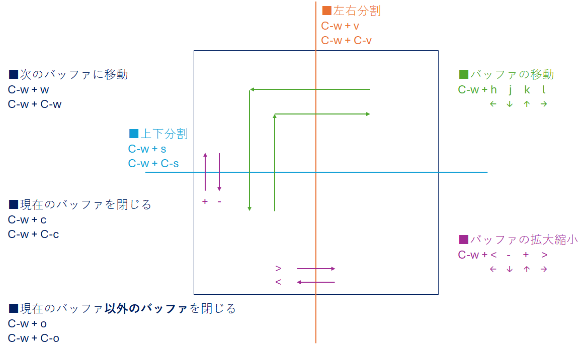

# Oziidi
@oziidi ([https://twitter.com/oziidi](https://twitter.com/oziidi))

## GitHub Branches

* [cygwin_gnupack](https://github.com/oziidi/cygwin_gnupack) 
  Optimized cygwin for gnupack_pretest_devel_2017-09-11. Removed cvs, subversion, git, ctags, python, & ruby from the cygwin.

* [gnupack_patches](https://github.com/oziidi/gnupack_patches) 
  Patches for gnupack-pretest_devel-2017.09.11. gnupack allows Windows OS users to use cygwin and emacs in a ready-to-use manner.

## vim カーソル移動

 
 

## vim バッファ移動・拡大・縮小

 
 
